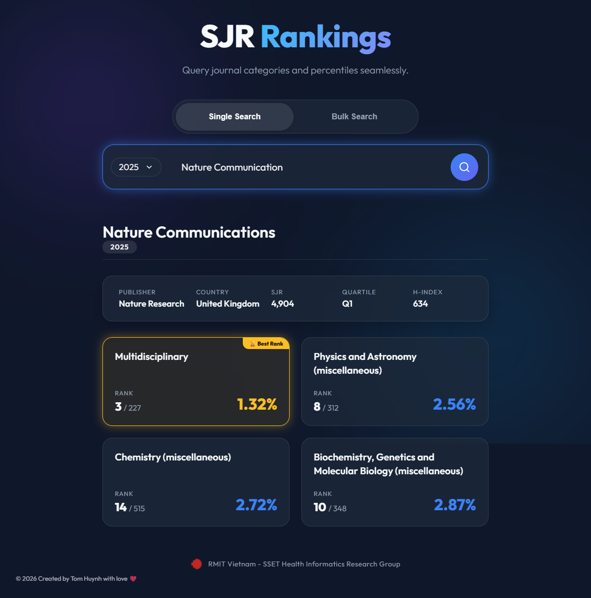
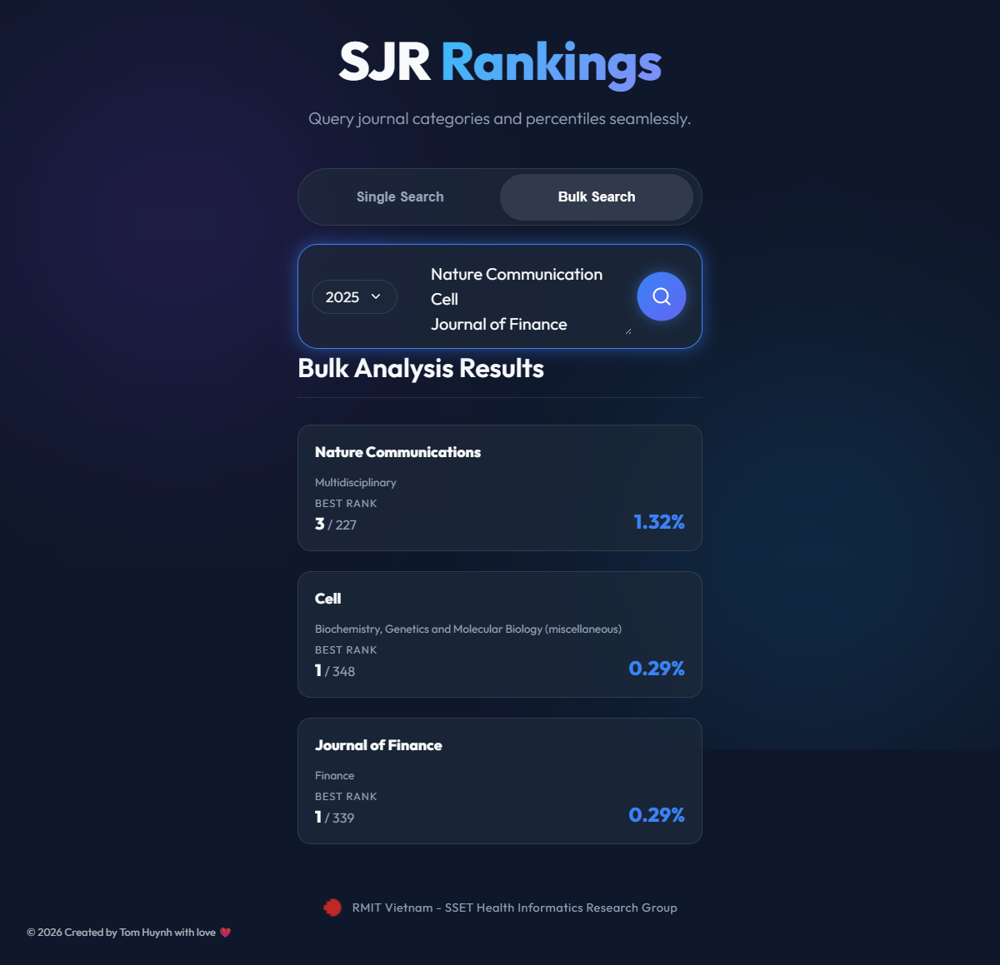

# SJR Ranking Query System

A powerful and fast Node.js web application designed to instantly query, calculate, and beautifully display journal rankings and percentiles from the Scimago Journal & Country Rank (SJR) database.

## 🚀 Features

- **Instant Results via Smart Caching**:
  - **Journal Info Cache**: Stores journal metadata (Name, SourceID, Subject Categories) to skip repetitive search scraping.
  - **CSV Ranking Cache**: Stores Scimago's official ranking CSVs locally. If a CSV is already cached for a given subject category and year, the system serves data instantly without any external requests.
- **Advanced Cloudflare Bypass**: Utilizes `puppeteer-extra` with stealth plugins and in-browser native `fetch` evaluation to seamlessly bypass Scimago's Cloudflare bot protection mechanisms.
- **Dynamic Percentile Calculation**: Automatically calculates a journal's exact percentile ranking within its subject categories (`Rank / Total Journals`).
- **Bulk Search Capabilities**: Features a dedicated "Bulk Search" mode allowing you to paste a list of multiple journals (separated by commas, semicolons, or newlines). The system processes them sequentially, isolating and displaying the single highest-ranking category for each journal instantly.
- **Premium User Interface**: Features a modern, expansive, dark-themed "glassmorphism" aesthetic built with vanilla CSS. Includes seamless tab toggling between Single and Bulk modes.
- **Intelligent Sorting & Highlighting**: Automatically sorts categories by the best performing percentile and highlights the "🏆 Best Rank" category.
- **Comprehensive Details**: Extracts and displays journal Publisher, Country, SJR Score, Quartile, and H-Index directly from the ranking data.
- **Batch Pre-fetching**: Includes a utility script to pre-download all subject category CSVs in the background to ensure lighting-fast zero-latency queries.





## 🛠️ Technology Stack

- **Backend**: Node.js, Express.js
- **Scraping & Automation**: Puppeteer, Puppeteer-Extra, Cheerio
- **Data Parsing**: csv-parse
- **Frontend**: HTML5, Vanilla CSS3 (Glassmorphism UI), Vanilla JavaScript

## 📦 Installation

1. **Clone the repository** (or navigate to the project directory):
   ```bash
   cd SJR-ranking-query-system
   ```

2. **Install dependencies**:
   ```bash
   npm install
   ```

## 💻 Usage

### 1. Start the Server
Run the following command to start the Express backend:
```bash
npm start
```
*The server will run locally on `http://localhost:3000`.*

### 2. Query Rankings (Single & Bulk)
- Open your browser and navigate to `http://localhost:3000`.
- **Single Search**: Type in the exact name of a journal (e.g., *Nature Communications*), select the desired ranking year, and click Search.
- **Bulk Search**: Click the "Bulk Search" toggle at the top of the search bar. Paste a list of journal names separated by commas or newlines (e.g., `Nature Communications, Cell, Journal of Finance`). Click Search and watch the live progress indicator as the system sequentially fetches and renders the highest-ranking category for each journal.

### 3. Pre-downloading CSV Cache (Optional but Recommended)
To make all queries for a specific year instantaneous, you can run the included batch downloading script. This script securely navigates Cloudflare and pre-downloads the CSV files for over 300 subject categories.

```bash
node scratch/download_csvs.js
```
*(You can edit `scratch/download_csvs.js` to change the `year` variable if you wish to pre-fetch a different year).*

## 📁 Project Structure

```text
SJR-ranking-query-system/
├── package.json             # Project dependencies and scripts
├── server.js                # Express API backend & Puppeteer scraping logic
├── public/                  # Frontend assets
│   ├── index.html           # Main UI layout
│   ├── style.css            # Glassmorphism aesthetic styling
│   ├── script.js            # Frontend logic & DOM manipulation
│   └── favicon.ico          # RMIT Favicon
├── info_cache/              # Auto-generated cache for journal search results
├── csv_ranking_files/       # Auto-generated cache for Scimago ranking CSVs
└── scratch/
    ├── download_csvs.js     # Utility script for batch downloading CSVs
    └── take_screenshot.js   # Automated Puppeteer script for capturing UI screenshots
```

## ⚠️ Important Notes on Scraping
Scimago uses Cloudflare Turnstile. Standard scraping techniques (like basic `axios` fetches) are actively blocked. This application solves this by:
1. Launching a headless Chromium browser with stealth plugins.
2. Navigating to `scimagojr.com` to establish a trusted session and clear the Turnstile challenge.
3. Executing a native `fetch()` command *inside* the browser's verified `page.evaluate()` context to download the CSV files seamlessly without CORS or 403 Forbidden errors.

---
*Developed for the RMIT Vietnam - SSET Health Informatics Research Group*<br>
*&copy; 2026 Created by Tom Huynh with love ❤️*
